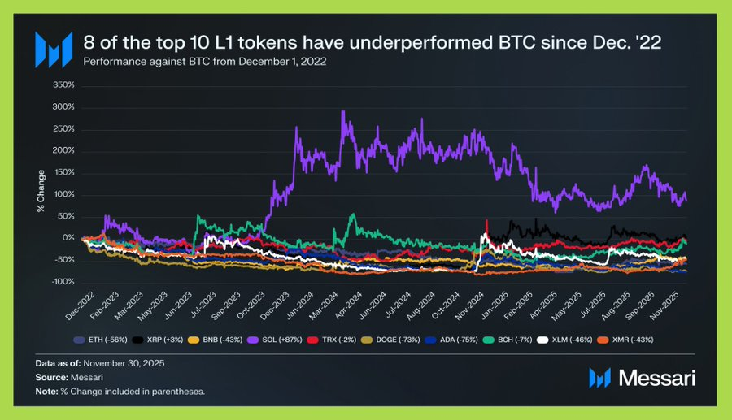
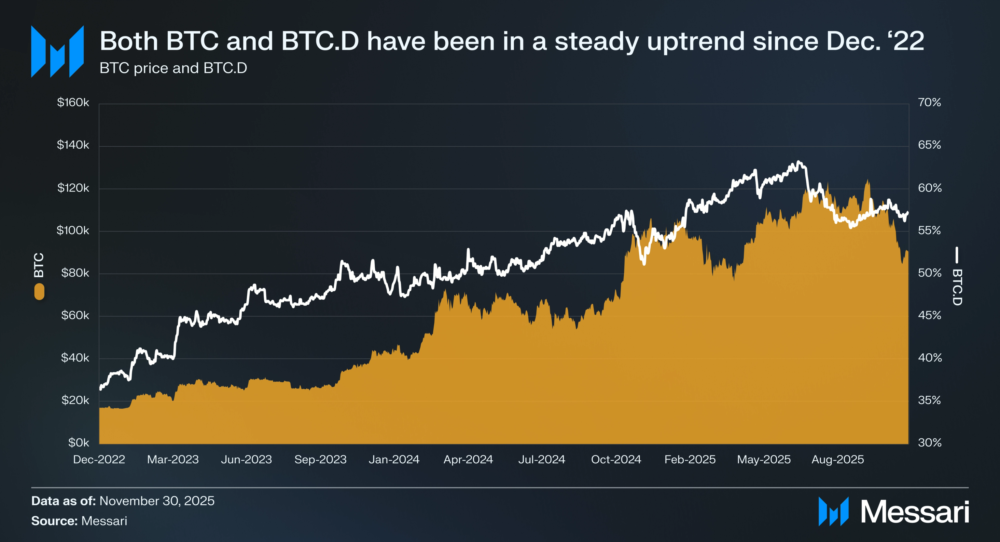

# Crypto Market Outlook: 2025 Review & 2026 Theses

## I. 2025 Context: The Year of Foundations

Năm 2025 đánh dấu sự chuyển dịch quan trọng từ "đầu cơ" sang "thể chế hóa", tạo nền móng vững chắc cho chu kỳ tăng trưởng bền vững của 2026.

### 1. Sự chấp nhận bùng nổ từ các tổ chức (Institutional Adoption)

* **Strategic Bitcoin Reserve**: Tháng 3/2025, Tổng thống Donald Trump đã ký lệnh hành pháp thiết lập *Dự trữ Bitcoin Chiến lược*, đánh dấu bước ngoặt lịch sử khi Bitcoin trở thành tài sản dự trữ quốc gia.

* **Quốc gia nhập cuộc**: Không chỉ Mỹ, các quốc gia như Cộng hòa Séc, Vương quốc Anh, Trung Quốc, Bhutan, và El Salvador tiếp tục duy trì và gia tăng lượng nắm giữ Bitcoin.

* **Dòng tiền Stablecoin**: Tỉ lệ stablecoin tăng mạnh, chạm ngưỡng **300 tỷ USD** trong năm 2025 và ước tính sẽ tăng gấp 3.3 lần lên **1.000 tỷ USD** vào năm 2026 -> Minh chứng rõ nét cho thấy dòng tiền thực đang đổ vào crypto để sử dụng chứ không chỉ đầu cơ.
  
  

### 2. Khung pháp lý trưởng thành (Regulatory Clarity)

Chuyển từ giai đoạn "thực thi cưỡng chế" sang giai đoạn minh bạch và khuyến khích đổi mới.

* **Việt Nam**: Có các bước đi cụ thể để hợp pháp hoá và quản lý crypto.
* **Hoa Kỳ**:
  * **23/01/2025**: Bãi bỏ SAB 121, cho phép các ngân hàng và tổ chức tài chính lưu ký Bitcoin/Crypto mà không cần ghi nhận là nợ trên bảng cân đối kế toán -> Mở cửa cho dòng vốn Wall Street.
  * **06/03/2025**: Sắc lệnh "Dự trữ Bitcoin Chiến lược", cho phép giữ BTC tịch thu thay vì đem đấu giá.
  * **18/07/2025**: Đạo luật GENIUS (liên quan stablecoin) giúp kiểm soát và hợp chuẩn hóa hạ tầng thanh toán on-chain.
  * **Xu hướng**: Từ "Cấm đoán" -> "Kiểm soát & Quản lý" -> "Khuyến khích có khuôn khổ".

### 3. Market Dynamics & The "Split"

Thị trường 2025 chứng kiến sự phân hóa rõ rệt (The Split) giữa Institutional và Retail.

* **Bitcoin Dominance**: BTC tiếp tục áp đảo hiệu suất so với đa số altcoins. Tổng vốn hóa crypto khoảng 3.26 nghìn tỷ USD, trong đó BTC chiếm 1.8 nghìn tỷ USD (~55%).
* **Altcoin Struggle**: Đa số altcoin không thể quay lại đỉnh cũ (ATH) ngay cả khi BTC phá đỉnh. Các L1 cũ đang tụt lại phía sau.
  * *Top L1 Caps*: ETH ($361B), XRP ($130B), BNB ($121B), SOL ($75B).
* **Solana Paradox**: Dù hệ sinh thái Solana tăng trưởng 2.000-3.000% (TVL +2.988%, Fees +1.983%, DEX Vol +3.301%), token SOL *chỉ* outperform BTC khoảng 87%. Điều này đặt ra câu hỏi về định giá của L1 token so với giá trị thực tế của hệ sinh thái.

.png)

Quả bom  BlackRock: Thị  trường nhạy cảm với tin BlackRock bán BTC , trong khi thờ ơ với các tin mua  vào. Điều này  có thể  kích hoạt đợt bán tháo trong tương lại.

    

---

## II. 2026 Outlook: The Year of Maturation (Theo Messari Theses)

Chủ đề bao quát cho năm 2026 là **Sự trưởng thành của ngành công nghiệp (Maturation)**. Dòng vốn sẽ không còn dễ dãi với những "lời hứa dài hạn" mà tập trung vào các tài sản có đặc tính tiền tệ (Monetary properties) và sản phẩm có tính ứng dụng hàng ngày (Daily Utility).

**Core Focus: From Hype to Utility**

### 7 Trụ cột Chính cho năm 2026 (The 7 Core Sectors)

Theo báo cáo *Messari Theses 2026*, triển vọng thị trường xoay quanh 7 mảng cốt lõi:

#### 1. Cryptomoney (Tiền tệ Mã hóa)

* Tập trung mạnh vào **Stablecoins**. Đây là "killer app" thực sự của crypto.
* Sự trỗi dậy của "Yield-driven DeFi banks" – nơi người dùng gửi stablecoin để nhận lãi suất thực, thay thế dần các tài khoản tiết kiệm truyền thống.
* Bitcoin củng cố vị thế là "Global Macro Asset" (Tài sản vĩ mô toàn cầu), cạnh tranh trực tiếp với Vàng.

#### 2. DePIN (Hạ tầng Vật lý Phi tập trung)

* Được đánh giá là mảng có tiềm năng tăng trưởng cao nhất ("High-upside frontier").
* **DePIN Dislocation**: Messari nhận định đang có sự lệch pha lớn giữa *hạ tầng thực tế* (đang phát triển nhanh) và *định giá token* (chưa phản ánh đúng). 2026 là năm các dự án có phần cứng thực sự đi vào hoạt động sẽ bứt phá.

#### 3. Crypto x AI

* Dự báo thị trường **30 nghìn tỷ USD vào năm 2030**.
* **Agentic Commerce**: Xu hướng các AI Agents tự động giao dịch on-chain. Bot sẽ là những users tích cực nhất của blockchain.
* Các mảng ngách: Decentralized model training (huấn luyện AI phi tập trung) và Robotics.

#### 4. The Multichain World

* Interoperability (Khả năng tương tác) không còn là một "tính năng" mà là "mặc định".

* **L1/L2 Wars**:
  
  1. Ethereum lấy lại vị thế thông qua các L2 mạnh như **Base** và **Arbitrum**.
     
     - **Gom giao dịch (Rollups):** Xử lý hàng nghìn giao dịch bên ngoài chuỗi chính (off-chain) rồi mới nén lại và gửi kết quả cuối cùng về Ethereum.
     
     - **Chi phí cực thấp:** Sau bản nâng cấp Dencun (EIP-4844), phí giao dịch trên các L2 này đã giảm xuống mức gần như bằng 0, giúp Ethereum cạnh tranh trực tiếp về phí với các chuỗi giá rẻ khác.
  
  2. **Solana** tiếp tục định vị mình là "On-chain NASDAQ" với tốc độ cao và chi phí thấp.
     
     * Nhanh 1 triệu TPS, xác thực <150ms 
     * đồng nhất, all tài sản ở 1 lớp, giảm phân mảnh
  
  3. Dự báo L2 sẽ chiếm 99% lượng transaction và tốc độ luân chuyển tiền tệ.  Base  (có lượng  người dùng cao) và  Arbitrum (trung tâm phái sinh), ko có OP do OP bị Base lấn áp và chọn sai  hướng theo Super chain, phân mảnh  của phân mảnh, ko có  thanh khoản, dead theo dot, atom. 

#### 5. TradFi x Crypto

* Sự hội tụ giữa tài chính truyền thống và crypto.
* **Tokenized Treasuries (RWAs)**: Trái phiếu chính phủ được token hóa để làm tài sản thế chấp trong DeFi.
* **Equity Perps**: Giao dịch phái sinh cổ phiếu trên chuỗi (On-chain).

#### 6. DeFi: Sustainable Finance

* Chuyển dịch từ "Yield Farming lạm phát cao" sang **Real Yield** (Doanh thu thực).
* **Decentralized Internet Finance**: Các giao thức DeFi phải chứng minh được giá trị qua phí giao dịch thực tế từ người dùng, thay vì in token để trả thưởng.

#### 7. Consumer Apps

* **Tipping Point**: Các ứng dụng Crypto đạt được sự chấp nhận đại chúng (Mainstream Adoption).
* **Invisible Tech**: Người dùng sử dụng sản phẩm crypto mà không cần biết (hoặc không quan tâm) họ đang dùng blockchain. Ví dụ: Betting, Social, Gaming.

.png)

### Key Trends & Predictions

* **Ownership Coins**: Xu hướng token đại diện cho quyền sở hữu hợp pháp + quyền kinh tế + quyền quản trị. Đây là sự tiến hóa của token từ "giấy lộn" thành tài sản có giá trị pháp lý.
* **Vàng kỹ thuật số**: Chu kỳ 4 năm (Halving) trở nên ít quan trọng hơn. Giá Bitcoin sẽ phụ thuộc nhiều hơn vào các yếu tố vĩ mô: Chính sách của FED, sự tích lũy của Ngân hàng Trung ương, và tình hình địa chính trị.

